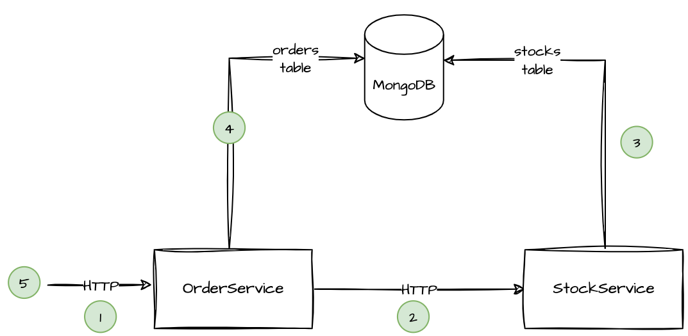

# Overview

This repository contains a sample project for a basic interservice communication between two REST-based (micro) services. 

The happy flow is depicted in the following diagram:


When a client want to order a group of products with different respective quantities, it sends a request to the order service (1). 
The order service then checks the stock service if the products are all available (2). If yes, the stocks quantities are updated (3)
and an order with these products is created (4). Finally, an orderId to identify the freshly created order is returned (5).

## General remarks

I've added 46 design thoughts as dedicated comments marked via `REMARK` and separated via indentation and blank lines.

- The order service is technically quite simple and does not contain many domain nor technical features, but shows how to 
  implement the basic interservice communication as well as an integration tests (where the stock service is stubbed). 
- A full end to end test, e.g. running and triggered on a CI/CD system was out of scope.
- The stock service is a bit more sophisticated, e.g. supporting more CRUD operations, and implementing basic mock tests 
  in addition to the integration tests.
- In a more professional project I would have moved shared functionality, e.g. for integration tests, into a common module.
- While there are many architectural styles (e.g. hexagonal, layered, clean, onion, etc.) I went with a very basic approach 
  mirroring a layered design.  TODO directoy structur
- In a perfect world, we would have completely separated the domain models from the technical 
  models which are used for exchanging data. For the sake of simplicity, I've sometimes mixed them. Having said that, it is
  very important to keep the domain models clean and not to leak technical details into them in a real-world project.
- We used transactions in the stock service to allow updates (and rollbacks) of multiple product quantities. This means that
  we also have to use a MongoDB cluster (since session support is necessary). We account for that in the corresponding
  docker-compose files.
- There is no input validation, i.e. does a restock quantity always have to be positive or are negative ones also permitted? 
  Validations are usually related to business rules and therefore omitted for this example.
- In general, I favor to start with a basic and simple design and refactor when necessary. This approach is not totally 
  feasible for API design ("once it's out, someone will use it, and they will complain if it's changed!") and one has to be
  more careful.
- For the return format of the response, we followed [JSend](https://github.com/omniti-labs/jsend), though we ommitted the 
  `status` field since it is not really necessary with appropriate HTTP status codes.

## Example

Prerequisites: Docker, Docker Compose, Gradle, a recent JDK and [httpie](https://httpie.io/) are installed. 

We show how to manually start the services and perform HTTP requests. Alternatively, below, you can find a script do
create docker containers and use the corresponding global docker-compose file to start everything via docker-compose.

Start the database
```bash
docker-compose -f stock-service/compose.yaml up
```

In another terminal, start the stock service (we could have also created docker files via the spring boot configuration)
```bash
cd stock-service
gradle bootRun
```

In another terminal, start the order service
```bash
cd order-service
gradle bootRun
```

In the rest of the example, we prefix commands with `$` and show the output of the command in the next lines. In (yet another) 
terminal, perform all HTTP REST requests. We start with creating two products with ids 1 and 2: 
```bash
$ http -v POST :8080/stock/1

POST /stock/1 HTTP/1.1
Accept: */*
Accept-Encoding: gzip, deflate
Connection: keep-alive
Content-Length: 0
Host: localhost:8080
User-Agent: HTTPie/3.2.1


HTTP/1.1 201
Connection: keep-alive
Content-Length: 0
Date: Tue, 25 Jul 2023 20:16:19 GMT
Keep-Alive: timeout=60
X-Request-Id: fd717bbf-7d9f-4f32-bc7a-5374345e88d7

$ http -v POST :8080/stock/2

POST /stock/2 HTTP/1.1
Accept: */*
Accept-Encoding: gzip, deflate
Connection: keep-alive
Content-Length: 0
Host: localhost:8080
User-Agent: HTTPie/3.2.1


HTTP/1.1 201
Connection: keep-alive
Content-Length: 0
Date: Tue, 25 Jul 2023 20:17:34 GMT
Keep-Alive: timeout=60
X-Request-Id: 31475563-0abd-40f8-9b91-c08fb5625f73
```

Let's restock them by 10 and 20 items, respectively:
```bash
$ http -v PUT :8080/stock/1 quantity=10

PUT /stock/1 HTTP/1.1
Accept: application/json, */*;q=0.5
Accept-Encoding: gzip, deflate
Connection: keep-alive
Content-Length: 18
Content-Type: application/json
Host: localhost:8080
User-Agent: HTTPie/3.2.1

{
    "quantity": "10"
}


HTTP/1.1 200
Connection: keep-alive
Content-Length: 0
Date: Tue, 25 Jul 2023 20:18:41 GMT
Keep-Alive: timeout=60
X-Request-Id: 8437fe49-d908-472e-8b8b-938068185649

$ http -v PUT :8080/stock/2 quantity=20

PUT /stock/2 HTTP/1.1
Accept: application/json, */*;q=0.5
Accept-Encoding: gzip, deflate
Connection: keep-alive
Content-Length: 18
Content-Type: application/json
Host: localhost:8080
User-Agent: HTTPie/3.2.1

{
    "quantity": "20"
}


HTTP/1.1 200
Connection: keep-alive
Content-Length: 0
Date: Tue, 25 Jul 2023 20:18:58 GMT
Keep-Alive: timeout=60
X-Request-Id: d33bf249-92b9-4f20-a55b-b4d4231b82f4
```

Now, we can order 5 items of product 1 and 10 items of product 2:
```bash
$ echo '{"orders":[{"productId":1,"quantity":5},{"productId":2,"quantity":10}]}'|http -v POST :8081/order
POST /order HTTP/1.1
Accept: application/json, */*;q=0.5
Accept-Encoding: gzip, deflate
Connection: keep-alive
Content-Length: 72
Content-Type: application/json
Host: localhost:8081
User-Agent: HTTPie/3.2.1

{
    "orders": [
        {
            "productId": 1,
            "quantity": 5
        },
        {
            "productId": 2,
            "quantity": 10
        }
    ]
}


HTTP/1.1 201
Connection: keep-alive
Content-Type: application/json
Date: Tue, 25 Jul 2023 20:23:54 GMT
Keep-Alive: timeout=60
Transfer-Encoding: chunked
X-Request-Id: ded537c2-c753-4f94-a0d3-d4ebedbfea8a

{
    "data": {
        "orderId": "64c02f5a9176061bdf1da0b2"
    }
}
```

We can retrieve the order by the returned orderId
```
$ http -v :8081/order/64c02f5a9176061bdf1da0b2
GET /order/64c02f5a9176061bdf1da0b2 HTTP/1.1
Accept: */*
Accept-Encoding: gzip, deflate
Connection: keep-alive
Host: localhost:8081
User-Agent: HTTPie/3.2.1


HTTP/1.1 200
Connection: keep-alive
Content-Type: application/json
Date: Tue, 25 Jul 2023 20:24:59 GMT
Keep-Alive: timeout=60
Transfer-Encoding: chunked
X-Request-Id: 0adf989d-c1ba-402d-a54e-5a3babc0d695

{
    "data": {
        "orderId": "64c02f5a9176061bdf1da0b2",
        "orders": [
            {
                "productId": 1,
                "quantity": 5
            },
            {
                "productId": 2,
                "quantity": 10
            }
        ]
    }
}
```

We receive an error if we want to retrieve unavailable quantities, e.g. 100 of product 1 but available 5 of product 2:
```bash
$ echo '{"orders":[{"productId":1,"quantity":100},{"productId":2,"quantity":5}]}'|http -v POST :8081/order
POST /order HTTP/1.1
Accept: application/json, */*;q=0.5
Accept-Encoding: gzip, deflate
Connection: keep-alive
Content-Length: 73
Content-Type: application/json
Host: localhost:8081
User-Agent: HTTPie/3.2.1

{
    "orders": [
        {
            "productId": 1,
            "quantity": 100
        },
        {
            "productId": 2,
            "quantity": 5
        }
    ]
}


HTTP/1.1 422
Connection: keep-alive
Content-Type: application/json
Date: Tue, 25 Jul 2023 20:26:13 GMT
Keep-Alive: timeout=60
Transfer-Encoding: chunked
X-Request-Id: 34c5708b-911b-4043-b17e-7faa48a780a4

{
    "message": "Insufficient stocks"
}
```

By querying the stock service we can check that the corresponding quantities are still sound, i.e. the failed request did not change existing stock quantities:
```bash
$ http :8080/stock/1
HTTP/1.1 200
Connection: keep-alive
Content-Type: application/json
Date: Tue, 25 Jul 2023 20:27:12 GMT
Keep-Alive: timeout=60
Transfer-Encoding: chunked
X-Request-Id: c915f82e-fd33-4544-a6e1-67e43caa06b7

{
    "data": {
        "productId": 1,
        "quantity": 5
    }
}


$ http :8080/stock/2
HTTP/1.1 200
Connection: keep-alive
Content-Type: application/json
Date: Tue, 25 Jul 2023 20:27:15 GMT
Keep-Alive: timeout=60
Transfer-Encoding: chunked
X-Request-Id: 603bc36b-a65b-4eaa-a2e9-f2c7e5110029

{
    "data": {
        "productId": 2,
        "quantity": 10
    }
}
```

## Using docker-compose

First, create both docker images comfortably via Spring Boot
```bash
$ cd stock-service && gradle bootBuildImage && cd ..
<lots of output...>
Successfully built image 'docker.io/library/stock-service:0.0.1-SNAPSHOT'

$ cd order-service && gradle bootBuildImage && cd ..
<output...
Successfully built image 'docker.io/library/order-service:0.0.1-SNAPSHOT'
```

Then, start the services via docker-compose
```bash
$ docker-compose up
```

Similar to the manual setup, all services are available via the same ports (8080 and 8081 respectively).

## Summary of executed httpie commands 

For convenience, here are all commands without their output for quick copy-paste:
```bash
http -v POST :8080/stock/1
http -v POST :8080/stock/2
http -v PUT :8080/stock/1 quantity=10
http -v PUT :8080/stock/2 quantity=20
# Successful order
echo '{"orders":[{"productId":1,"quantity":5},{"productId":2,"quantity":10}]}'|http -v POST :8081/order
# Non-successful order
echo '{"orders":[{"productId":1,"quantity":100},{"productId":2,"quantity":5}]}'|http -v POST :8081/order
http :8080/stock/1
http :8080/stock/2
```
